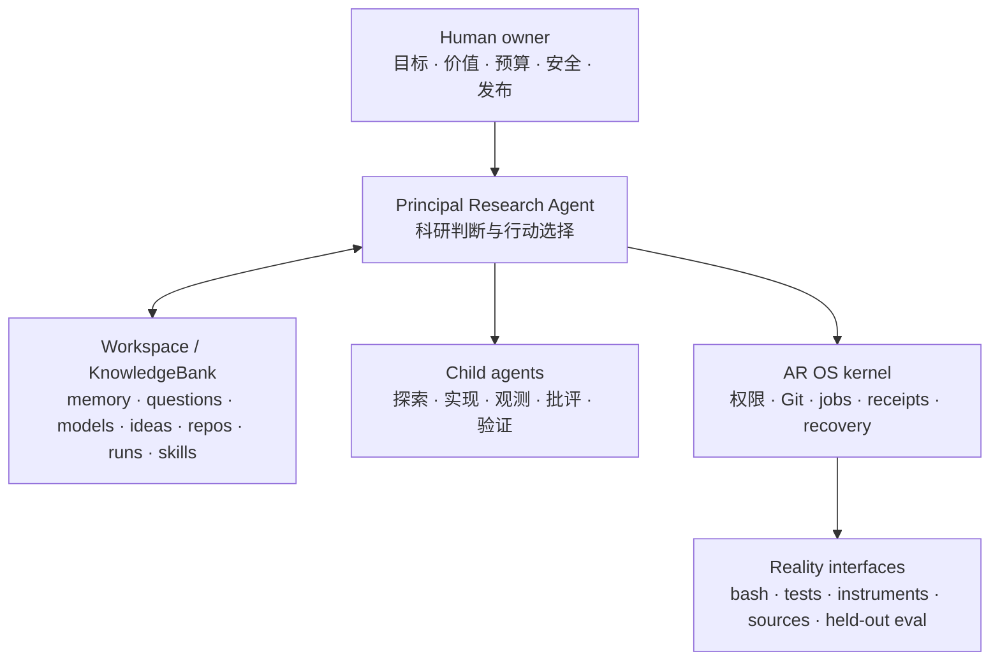

# AR OS DESIGN BOOK v1.0

## Agent-Principal Research Operating System

**状态：** 根本性重构提案，可作为下一代实现的规范基线
**版本：** v1.0.0
**日期：** 2026-07-31
**取代的系统本体：** ProContract Auto-Research OS v0.5.0 及更早的 L1/L2/L3 架构 /workspace/opencode/specs/pro-contract.md
**继续保留：** 持久证据、Git lineage、原始 trace、隔离执行、独立测量、资源边界、前瞻预测、held-out evaluation、crash recovery
**核心问题：** 如果 Research Agent 是科研主体、也是 AR 环境的直接使用者，什么才是能真正放大其科研能力的最小 Operating System？

---

## 0. 最终判断

AR OS 必须完成一次主客体倒置：

```text
旧范式：
  AR 系统拥有语义状态机
  -> Coordinator 决定阶段和下一步
  -> 调用多个 Agent role
  -> Worker 返回 typed patch
  -> Coordinator 推进 K / M / G

新范式：
  Research Agent 进入一个持久、可执行的 research workspace
  -> 自己阅读、思考、搜索、建模、写代码、委派、实验、解释和修正
  -> AR OS 提供文件系统、Git、进程、权限、资源、实验装置、事件和恢复能力
```

因此：

> AR OS 不再是“调用 Agent 的 OS”，而是“Agent 用来做研究的 OS”。

新版只有一个持久语义底座：

\[
\boxed{\text{KnowledgeBank} \equiv \text{整个版本化 research workspace}}
\]

ScientificModel 和 IdeaGraph 仍然非常重要，但不再是 OS 拥有的独立状态机：

\[
\begin{aligned}
\text{ScientificModel}
&= \text{Agent 对 workspace 的解释性压缩},\\
\text{IdeaGraph}
&= \text{Agent 对 workspace 的前瞻行动投影}.
\end{aligned}
\]

Questions、sources、evidence、repos、code、eval、runs、logs、models、ideas、decisions、memory、skills 和 subagent artifacts 都存在同一个可寻址、可搜索、可执行、可回滚的研究世界中。

Context window 只是 RAM/cache；chat transcript 只是过程 trace；二者都不是项目的持久记忆。

系统中心是 Principal Research Agent：

- 负责理解完整课题；
- 负责问题选择、taste、建模、行动选择和解释；
- 可以主动 fork subagent 进行并行探索、实现、批评、验证和观测；
- 可以直接修改 project memory、questions、ScientificModel、IdeaGraph、代码、分析和 skills；
- 不需要 Python Coordinator 告诉它现在属于 framing、modeling 还是 ideation 阶段。

AR OS kernel 刻意保持“没有科研语义”：

- 管 capability、permission 和 budget；
- 管 Git、branch、worktree 和 provenance；
- 管 foreground command 与 long-running job；
- 管 exact command、environment、log、metric、artifact 和 receipt；
- 管 evaluator 的独立性和 protected path；
- 管 interrupt、wake-up、checkpoint、resume 和 recovery；
- 但绝不决定哪个 hypothesis 更重要、哪个 model 更可信、下一个 scientific action 是什么。

完整系统关系：



一句话：

> Agent 思考并选择；workspace 记住一切；OS 让行动可持续、可测量、可恢复；现实拥有最后否决权。

---

## 1. v0.3–v0.5 的根本问题

旧设计并不是没有价值。它正确发现了：

- 本地 attempt 不是长期研究；
- raw trace 不能丢；
- experiment 和 idea 必须分离；
- parallel worker 要隔离；
- evaluator 不能信 worker 自报；
- 重要预测要在结果之前写下；
- dev gain、artifact admission 和 mechanism truth 不同；
- invalid run 不能 refute hypothesis；
- memory 必须外化。

但旧设计一直保留了一个隐藏前提：

> 科研语义应该由 OS 拆解成若干 canonical object，再由 Coordinator 按固定顺序推进。

这导致五个问题。

### 1.1 Coordinator 变成了虚假的上位智能

Coordinator 决定：

- 何时 frame；
- 何时 build model；
- mechanism 是否成熟；
- graph node 是否 ready；
- worker 是否可执行；
- finding 何时可改变 belief；
- frontier 何时重建。

但 Coordinator 并不真正理解科研。它的“智能”来自反复调用 Agent，再把 Agent 的理解塞进预定义状态机。

结果是：

```text
一个真正理解问题的 Agent
被降格成若干 semantic RPC；

一个并不理解问题的 state machine
反而成为科研过程的上位控制者。
```

### 1.2 Role proliferation 把一个完整心智切碎

ResearchFramer、Reader、ClaimAtomizer、ModelBuilder、ModelSkeptic、IdeaProposer、ResultInterpreter 等都可以是有用的 cognitive move。

但它们不必成为长期存在的系统角色。

把每种思维动作都变成 Agent service 会造成：

- 每一跳都要重建上下文；
- 隐含信息在 handoff 中丢失；
- reading、modeling、coding、experimenting 被人为割裂；
- role prompt 和 schema 成为维护负担；
- 每个 Agent 只对局部格式负责，没有谁真正拥有整个问题；
- 系统越来越会“像一个科研组织”，却不一定越来越会科研。

更自然的做法是：

```text
一个强 principal Agent 持有全局理解；
skill 提供可复用的思维方法；
subagent 只在独立、并行或需要隔离时临时 fork。
```

### 1.3 Atomic K/M/G generation 过度形式化了认知

旧设计规定：

```text
observation -> KnowledgeBank -> ScientificModel -> IdeaGraph
```

这是一条好的审计原则，但不应该成为 OS law。

真实科研不是严格流水线：

- 读一篇 paper 可能同时改变问题、机制和实验想法；
- 看一段 trace 可能先发现 evaluator 错了；
- 写 instrumentation 的过程中会重新理解系统；
- implementation failure 可能暴露的是 conceptual error；
- 一个 surprise 可能让 Agent 立即重构问题，而不是等待下个 reducer。

真正需要守恒的是：

> 当一个重要的解释、决策或行动被持久化时，它的证据、假设、来源、作用域和后果必须可检查。

Git commit 已经可以原子地保存整个 workspace 的一致快照。没有必要再构造一套试图模拟 Agent 心智顺序的 semantic transaction protocol。

### 1.4 Frozen contract 冻结了不该冻结的东西

以下内容应该 freeze：

- base commit；
- evaluator；
- visible/hidden split；
- budget；
- protected paths；
- preregistered prediction；
- seed、dataset、resource 和 stop condition；
- 需要可比性的 measurement protocol。

以下内容通常不该 freeze：

- Agent 的局部推理；
- 具体实现路径；
- 发现 premise 错误后的方法调整；
- 一个更便宜、更强 discriminator；
- 研究过程中自然打开的局部 subquestion。

正确原则是：

```text
冻结可解释性、可比性、安全和成本所必需的部分；
让科研方法本身保持自由。
```

### 1.5 Canonical writer 取代了 Agent 的直接行动

“Agent propose，deterministic code mutate”适合严格数据库，不适合作为整个科研 workspace 的总原则。

新版中：

- principal Agent 可以直接修改 semantic files；
- child Agent 在自己的 branch/worktree 修改；
- Git diff 就是 KnowledgePatch、ModelPatch、IdeaPatch；
- linter 只检查机械 invariant；
- principal Agent 负责 review、merge 和意义上的 assimilation；
- deterministic code 只对 hash、process、permission、evaluator invocation 和 receipt 负责。

---

## 2. 第一性原理

### 2.1 Scientific Principal Axiom

在人类授权的研究边界内，Agent 是唯一整合完整科研状态并选择 research action 的主体。

这不意味着 Human 消失，而是明确分工：

```text
Human owner：
  定义目标、价值、预算、安全、伦理和 publication boundary。

Principal Research Agent：
  在授权范围内拥有科研判断、策略、解释和行动选择。

AR OS：
  提供并约束能力、资源、执行、持久化和测量。
```

Human 是 constitutional principal；Agent 是 scientific principal。

### 2.2 Workspace Continuity Axiom

任何必须跨越 session、compaction、model/provider 切换、机器重启而继续存在的状态，都必须进入 project workspace。

因此：

```text
chat history            不是 canonical memory
model hidden state      不是 canonical memory
全局默认 memory 目录     不是 canonical project memory
subagent response       不是 durable artifact，除非写回 workspace
```

### 2.3 Independent Reality Axiom

Agent 可以提出解释和预测，但不能自己制造用来判断这些解释的 observation。

可信 observation 必须来自可检查的现实接口：

- bash command；
- tests；
- benchmarks；
- formal checker；
- instrumented run；
- dataset；
- external source；
- human observation；
- protected or held-out evaluation receipt。

### 2.4 Semantic Freedom Axiom

OS 不应编码 universal scientific workflow、universal BeliefEngine、universal Idea scheduler 或 mechanism maturity ladder。

它们可以是：

- project skill；
- domain-specific script；
- replaceable search policy；
- Agent-authored convention；
- experiment protocol。

这些属于 user space，不属于 kernel。

### 2.5 Provenance Before Governance Axiom

系统应优先让科研动作可检查、可回滚，而不是优先禁止 Agent 思考或写入。

优先使用：

```text
Git commit                 而不是 semantic mutation API
worktree                   而不是禁止所有并行写入
exact run manifest         而不是 worker self-report
protected evaluator path   而不是 Authority Agent
explicit evidence links    而不是 mandatory belief enum
```

### 2.6 Fork Isolation Axiom

并行认知有收益；多个 Agent 同时修改同一状态通常没有收益。

- read-only subagent 可以共享 workspace；
- write-heavy subagent 必须有 worktree、branch 或显式 disjoint path ownership；
- child output 只有在 principal Agent merge/assimilate 后才成为当前项目状态。

### 2.7 Positive-Gain Axiom

每个 AR OS 组件必须至少增加一项：

- agency；
- continuity；
- observability；
- trust；
- isolation；
- reproducibility；
- resource control；
- retrieval efficiency。

如果一个模块只是在复述强 Agent 本来就能完成的认知步骤，应当删除。

---

## 3. 数学形式化

### 3.1 持久状态

令：

- \(\mathcal W_t\)：时刻 \(t\) 的版本化 project workspace；
- \(\mathcal P_t\)：jobs、worktrees、leases、child tasks 和 event inbox 等 runtime state；
- \(\mathcal C_t\)：capability、permission 与 resource envelope；
- \(h_t\)：Agent 当前 context 内的临时 hidden state；
- \(\omega_t\)：外部世界；
- \(o_t\)：工具和 evaluator 返回的 observation。

持久系统状态为：

\[
\mathcal S_t=(\mathcal W_t,\mathcal P_t,\mathcal C_t)
\]

有意不把 \(h_t\) 放进系统状态，因为它随时可能因 session end、compaction 或 provider change 消失。

### 3.2 Boot

Agent 启动时构造一个有限 context：

\[
c_t=\operatorname{Boot}(\mathcal W_t,\mathcal P_t,\mathcal C_t)
\]

Boot 不应把整个 KB 塞入 prompt。它只提供：

- mission 和 constraints；
- current thesis 与 strongest counterevidence；
- live questions；
- active/completed/lost/blocked runs；
- unread child/run events；
- Git dirty state、branch 和 worktree ownership；
- relevant skills；
- evaluator 和 budget 状态。

之后 Agent 按需 retrieve。

### 3.3 Agent action

Scientific action 由 Agent 选择：

\[
a_t\sim
\pi_A\!\left(
\cdot\mid
h_t,c_t,\operatorname{Retrieve}(\mathcal W_t),o_{\le t}
\right)
\]

OS 不计算 \(a_t\)，只检查：

\[
\operatorname{Admit}(a_t;\mathcal C_t)
\in\{\text{allow},\text{ask},\text{deny}\}
\]

### 3.4 Kernel transition

对允许执行的 operation：

\[
(\mathcal W_,\mathcal P_,o_)
============================

\mathcal K(\mathcal W_t,\mathcal P_t,a_t,\omega_t)
\]

Kernel 可以：

- 修改或 snapshot 文件；
- fork worktree；
- 启动、暂停、终止 process；
- 记录 receipt；
- 返回 tool/evaluator observation；
- 写入 completion/anomaly event。

Kernel 不可以判断 focal model 是否比 rival 更真。

### 3.5 Session-boundary sufficiency

任意可恢复边界都应存在：

\[
\Sigma_t=
\langle
\text{HEAD},
\text{mission},
\text{current thesis},
\text{open questions},
\text{active runs},
\text{obligations},
\text{unassimilated events},
\text{candidate next moves}
\rangle
\]

使得一个全新的强 Agent 不读取原始 transcript 也能继续工作。

这是新版最重要的 continuity acceptance criterion。

### 3.6 Research value

项目仍可把以下量作为 normative objective：

\[
\frac{
\text{decision-relevant、reproducible 的 belief / artifact 改进}
}{
\text{time}+\text{compute}+\text{risk}
}
\]

但 OS 不应假装自己能 universal scalarize 它。

Agent 根据问题、model、evidence 和 constraints 估计 action value；OS 只负责记录真实 cost 和 outcome，供之后 calibration。

---

## 4. Kernel 与 User Space 的边界

### 4.1 Kernel 负责什么

| Kernel area | 责任                                                            |
| ----------- | --------------------------------------------------------------- |
| Filesystem  | path、permission、atomic replacement、content hash              |
| Git         | commit、branch、worktree、diff、merge lineage、rollback         |
| Process     | start、status、heartbeat、stop、timeout、exit receipt           |
| Resource    | CPU/GPU/memory/time/token/spend budget 与 lease                 |
| Evaluation  | 调用 exact command、保存 raw output、解析声明过的 metric        |
| Isolation   | protected path、sandbox、child ownership                        |
| Event       | run complete、anomaly、child done、permission、deadline         |
| Recovery    | 从文件、process 和 Git 恢复，而不是依赖内存                     |
| Audit       | command、environment、artifact、evaluator、cost、result lineage |

### 4.2 Principal Agent 负责什么

- research framing；
- literature/repo reading；
- question decomposition；
- theory、mechanism 和 rival formation；
- experiment design；
- code 与 evaluator design；
- subagent delegation；
- action selection；
- trace 和 phenomenon interpretation；
- ScientificModel revision；
- IdeaGraph revision；
- memory distillation；
- skill creation/revision；
- stop、persist、suspend、pivot。

### 4.3 不应成为 kernel API 的语义动作

以下接口不应成为系统核心：

```text
update_belief
promote_mechanism
select_best_idea
advance_campaign_stage
rebuild_scientific_model
declare_question_resolved
generate_next_frontier
```

这些是 Agent 的认知行为。Agent 通过读写 workspace 完成；skill 可以指导，但 OS 不接管。

### 4.4 真正有用的 system calls

```text
inspect      观察 project 与 runtime 现状
search       检索 files、history、evidence、logs、symbols
checkpoint   持久化当前科研状态与 Git snapshot
fork         创建 child task 或 isolated worktree
exec         执行 bounded foreground command
run          启动 durable background experiment
observe      读取 log、metric、resource、evaluator output
signal       message、steer、pause、resume、stop
merge        吸收 child branch 或 candidate artifact
admit        运行 protected / held-out artifact admission
audit        检查 lineage、protection、reproducibility、budget
```

这些是 OS verb，而不是 scientific stage。

---

## 5. Workspace 就是 KnowledgeBank

### 5.1 新定义

KnowledgeBank 不再只是“curated claims 的 registry”。

它是：

> Agent 用来记住项目、理解问题、执行行动、重遇证据和恢复工作的完整、版本化、可搜索、可执行研究环境。

它包含：

- source material 与 citation；
- curated knowledge 与 synthesis；
- questions 与 current answers；
- ScientificModel 与历史 revision；
- ideas 与 interventions；
- code repositories 与 exact commits；
- evaluator definition；
- experiment definition；
- raw logs、metrics 和大 artifact 的 content-addressed pointer；
- analysis 与 decision；
- project memory；
- project-local skills；
- child task、return 和 mailbox；
- budget、permission 和 process receipt。

### 5.2 Raw experience 与 knowledge 的正确关系

“raw experience 不是自动成立的 knowledge”仍然正确。

但它不应该被排除在 KnowledgeBank 之外。

Meta-Harness 的重要启示是：强 Agent 能从完整 filesystem 中有选择地回看历史 code、trace 和 failure，发现 summary 已经压掉的长程因果信息。

正确结构是：

```text
一个 workspace
  + 多种 epistemic layer
  + on-demand retrieval
  + 清晰 provenance
```

Raw log 不会自动变成 claim，但永远保留为 Agent 可以重新检查的现实痕迹。

### 5.3 One substrate, multiple views

```text
knowledge/    curated sources、claims、notes、syntheses
model/        当前和历史 explanatory compression
questions/    open、answered、blocked、reframed questions
ideas/        probes、experiments、constructions、audits
repos/        target artifacts 或 pinned repo refs
eval/         measurement apparatus 与 analysis program
runs/         raw observations、metrics、status、artifact pointers
memory/       compact continuity 与 decision memory
.agents/      project-local procedural memory
```

这些不是不同 authority，而是同一个研究世界的不同区域。

### 5.4 推荐目录

```text
<workspace>/
  AGENTS.md
  AROS.md
  ar.toml
  README.md

  memory/
    BOOT.md
    NOW.md
    decisions/
    episodes/
    patterns/
    inbox/

  questions/
    INDEX.md
    FRONTIER.md
    Q-0001-short-name/
      question.md
      evidence.md
      answer.md
      ideas/

  model/
    CURRENT.md
    rivals/
    mechanisms/
    predictions.jsonl
    anomalies/
    revisions/

  knowledge/
    sources/
    papers/
    repos/
    claims/
    syntheses/
    terminology/

  ideas/
    INDEX.md
    I-0001-short-name.md
    archived/

  repos/
    manifest.yaml
    <repo-name>/

  eval/
    README.md
    suites/
    scripts/
    configs/
    baselines/
    analysis/
    protected/

  experiments/
    E-0001-short-name/
      brief.md
      prediction.md
      protocol.yaml
      analysis.md

  runs/
    ACTIVE.md
    <run-id>/
      manifest.yaml
      launch.sh
      status.json
      events.jsonl
      stdout.log
      stderr.log
      metrics.jsonl
      observations/
      artifacts/
      final.json

  agents/
    tasks/
    returns/
    mailboxes/

  .agents/
    skills/
      <skill-name>/
        SKILL.md
        references/
        scripts/

  .codex/
    config.toml
    agents/
    hooks.json
    hooks/

  .opencode/
    agents/
    tools/
  opencode.json

  scripts/
    ar
    ar-boot
    ar-status
    ar-run
    ar-task
    ar-audit

  .aros/
    receipts/
    events/
    indexes/
    processes/
    leases/
    locks/
    objects/
    worktrees/
```

### 5.5 Git、runtime 和 CAS

**应进入 Git：**

- questions、models、ideas、memory、skills；
- evaluator code 和 experiment brief；
- 小型 result summary 和 metric；
- repository/candidate refs；
- decision、analysis；
- OS policy 与 schema。

**应留在 runtime state：**

- lock、PID、socket、temporary file；
- process heartbeat；
- machine-local resource lease；
- cache 和 derived index。

**大文件进入 CAS/object store：**

- full logs；
- checkpoint；
- dataset；
- model weight；
- 大型 trace 和 artifact。

Git 中保留：

- content hash；
- byte size；
- location；
- producing run；
- producing commit/command；
- retention policy。

逻辑上的 KB 包含这些 object，即使 byte 不在 Git blob 内。

### 5.6 Embedded mode 与 Portfolio mode

**Embedded mode：单一代码 repo 的默认模式**

- code repo root 就是 AR workspace；
- memory、questions、model、eval、experiments 作为 repo 的 project state；
- Codex/OpenCode 自然发现 root AGENTS.md 和 .agents/skills；
- Git worktree 同时隔离 code 与 research state。

**Portfolio mode：多 repo 或非代码课题**

- 顶层 meta-workspace 本身由 Git 管理；
- repos/manifest.yaml pin 各 repo 与 commit；
- child worktree 获得生成的 bootstrap instruction；
- 顶层 principal Agent 保持跨 repo 的全局理解。

不要为了“general”提前引入 Portfolio mode。只有真实需要多 repo 时再使用。

---

## 6. Project Memory

### 6.1 Memory 必须 project-local

Provider 默认 memory 可以作为便利缓存，但不能成为任何 required fact、decision、convention 或 open question 的唯一位置。

推荐：

```text
Canonical continuity：
  memory/ + questions/ + model/ + Git history

Optional provider memory：
  personal preference 与 recall cache
```

严格 AR run 中，建议关闭 Codex/OpenCode 的跨项目自动 memory，或至少关闭当前 session 对其读写，避免隐性跨项目污染。

### 6.2 Memory taxonomy

| 类型               | 路径                  | 含义                                                      |
| ------------------ | --------------------- | --------------------------------------------------------- |
| Working memory     | memory/NOW.md         | 当前 thesis、commitment、run、blocker、next possibilities |
| Boot memory        | memory/BOOT.md        | 新 Agent 的 compact entry point                           |
| Episodic memory    | memory/episodes/      | 一次有意义 session、failure 或 transition 发生了什么      |
| Decision memory    | memory/decisions/     | 为什么做出重要科学或架构选择                              |
| Pattern memory     | memory/patterns/      | 重复出现的局部 lesson 和 failure pattern                  |
| Procedural memory  | .agents/skills/       | 可执行 research habit 和 workflow                         |
| Prospective memory | questions/FRONTIER.md | 未来值得关注的问题与 commitment                           |
| Raw experience     | runs/ 与 artifacts    | 可重新检查的 experience，而非预压缩结论                   |

### 6.3 NOW.md contract

memory/NOW.md 应短到每次 serious restart 都能读取。

应包含：

```text
Mission 与当前 success criteria
Current best explanation
Strongest counterevidence 与 live rivals
上次 checkpoint 后发生的关键变化
Active experiments 与预计完成情况
未 assimilate 的 child/run results
Current blockers 与 obligations
Promising next moves
更深文件的 links
```

不应变成：

- transcript；
- daily diary；
- questions 的全部复制；
- 自动生成的文件清单；
- Agent 不经重新观察就服从的 stale plan。

### 6.4 BOOT.md contract

memory/BOOT.md 是一个 view，最好由 scripts/ar-boot 根据以下内容生成：

- AROS.md；
- memory/NOW.md；
- questions/FRONTIER.md；
- runs/ACTIVE.md；
- unread event inbox；
- Git/worktree status；
- budget 和 permission state。

它不是 source of truth。

### 6.5 Checkpoint protocol

以下事件发生后应 checkpoint：

- question reframe；
- important experiment launch；
- decisive result arrival；
- working model change；
- child branch merge；
- new durable skill；
- session 即将结束或 compact。

Checkpoint：

1. 直接更新相关 semantic files。
2. 更新 memory/NOW.md 的压缩状态。
3. 确认 active run/task link 正确。
4. 保存重要 decision rationale。
5. 创建 coherent Git commit。

OS 可以提醒和 lint，但不能替 Agent 生成科研意义。

### 6.6 Memory GC

Memory compression 由 Agent 完成，而不是靠遗忘：

- NOW 中被替换的内容进入 episode/decision；
- 重复 pattern 进入 pattern note 或 skill；
- raw trace 留在 runs/CAS；
- stale pointer 由 audit 发现；
- Git 保存历史。

目标不是让 boot context 装下全部历史，而是让全部历史都可恢复。

---

## 7. Questions 是最根本的研究拓扑

### 7.1 Question 比 Idea 更基本

Idea 只有相对于某个 question 才有意义。科研进步更接近“问题的可回答性发生变化”，而不是“Idea 数量增加”。

因此 primary topology 应是 ResearchGraph，anchor node 是 Question。

节点类型：

```text
Question
Model / Hypothesis
Prediction
Action / Idea
Observation / Finding
Artifact
Decision
```

边类型：

```text
decomposes
depends_on
answers
explains
challenges
predicts
tests
distinguishes
produces
updates
opens
blocks
supersedes
```

ScientificModel 与 IdeaGraph 是其投影：

\[
\begin{aligned}
\text{ScientificModel}&=\operatorname{ExplainView}(\text{ResearchGraph}),\\
\text{IdeaGraph}&=\operatorname{ActionView}(\text{ResearchGraph}).
\end{aligned}
\]

### 7.2 Question file

每个 load-bearing question 使用一个小目录和 question.md：

```yaml
---
id: Q-0007
status: open
parents: [Q-0001]
scope: rl-post-training
last_revised: 2026-07-31
---
```

正文：

```text
# Question

## 为什么它是 load-bearing
## 当前最佳回答
## Live alternatives
## 已知事实
## 尚未观测的变量
## 什么 evidence 会改变回答
## Answer / stop / pivot criteria
## 关联 model、idea、experiment、finding
```

Frontmatter 只承载 ID、link 和少量 navigation metadata，不承载“真理 enum”。

### 7.3 Frontier

questions/FRONTIER.md 是 principal Agent 当前的 attention map。

它可以包含：

- 一个 dominant question；
- 几个相互独立的 branch；
- 等待 run 的 blocked question；
- 一个 speculative adjacent question；
- 一个被明确 deprioritize 的方向。

它不是自动 queue。Agent 每次重新观察 workspace 后都可以改写它。

### 7.4 Graph implementation

起步时不要 graph database。

使用：

- Markdown frontmatter 中的 stable ID；
- explicit file links；
- rg 与 Git history；
- 可重建的 index.jsonl 或 graph.json；
- visualization/lint script；
- 必要时增加 SQLite、DuckDB、vector index 作为 cache。

Meaning 的 source 仍是 editable files。

---

## 8. ScientificModel 的新角色

### 8.1 定义

ScientificModel 是：

> Principal Agent 对相关世界如何运作的显式、可修正压缩；它应足以解释重要 observation，并产生 discriminating prediction 或 construction。

它不是：

- database-generated belief state；
- mandatory causal graph；
- Authority-certified truth；
- 每次 finding 后 OS 自动调用的 stage；
- 只有 reconciler 能替换的 immutable object。

它是 KB 中最重要的 living research artifact。

### 8.2 一个好的 model 应暴露

- boundary 与 scope；
- objects、variables、observables；
- equations、algorithms、mechanisms、invariants；
- assumptions；
- load-bearing causal/logical links；
- rivals 或明确缺少 rival；
- predictions 与 intermediate phenomena；
- anomalies 和 model misses；
- evidence/code refs；
- intervention surface。

### 8.3 推荐结构

```text
model/
  CURRENT.md
  rivals/
    M-0002-rival-name.md
  mechanisms/
    MEC-0004-mechanism-name.md
  predictions.jsonl
  anomalies/
    A-0003-anomaly-name.md
  revisions/
    2026-07-31-critic-bottleneck.md
```

CURRENT.md 应可完整阅读；复杂 equation、mechanism 和 trace 放在 linked file。

### 8.4 Agent 直接 revision

Principal Agent 检查 evidence 后可以直接修改 CURRENT.md。

好的 revision commit 说明：

```text
model 的什么变了
哪个 observation 或 argument 触发改变
哪个 assumption / mechanism / boundary / rival 改变
之前哪个 prediction 成功或失败
新打开或被降权的 question/action
```

不需要 ModelPatch API。Git diff 就是 ModelPatch。

### 8.5 Prediction

Prospective prediction 继续是核心科研纪律，但不必成为每个 action 的 ceremony。

对 decisive experiment，应预先记录：

- expected endpoint；
- expected intermediate trajectory；
- rival-specific outcome；
- plausible failure mode；
- 什么会 surprising；
- 结果最多能说明什么、不能说明什么。

Launch 后 prediction append-only。发现写错时添加 correction，不回改原 forecast。

### 8.6 Plurality

Rival 必须保持可见，但系统不应制造假对称。

Agent 可以维护：

- focal model + null；
- 多个 serious rivals；
- 一组 local mechanism hypotheses；
- formal conjecture + counterexample search；
- “现有 vocabulary 不足”的 model inadequate 状态。

Plurality 是思维纪律，不是 schema quota。

### 8.7 Executable ScientificModel

能 executable 时尽量 executable：

- equation notebook；
- simulator；
- causal/dependency diagram generator；
- prediction script；
- invariant checker；
- log probe；
- mechanism-revealing test。

Executable model 能把 explanation 与 observation 拉得更近。

---

## 9. IdeaGraph 的新角色

### 9.1 定义

IdeaGraph 是：

> 对可能获取知识或改变 artifact 的行动，以及它们与 question、model、evidence、dependency、cost 和 prior outcome 关系的持久地图。

它帮助 Agent 记住探索过的 search space，但不替 Agent 选择下一步。

### 9.2 Action kinds

```text
acquire
reproduce
instrument
diagnose
map_boundary
discriminate
intervene
ablate
transfer
audit
construct
prove
refactor
meta
```

它们是 tag，不是 stage。

### 9.3 Idea file

```yaml
---
id: I-0021
status: candidate
questions: [Q-0007]
models: [M-current, M-0002]
depends_on: [I-0017]
estimated_cost: gpu-small
---
```

正文：

```text
# Idea

## 为什么值得考虑
## Target question / bottleneck
## Proposed action
## 各 live model 下的 expected observations
## Minimal controls 与 evaluator
## Cost、risk、required capabilities
## Failure 仍能学到什么
## Related prior attempts
## Experiment / task links
```

只有 retrieval 和 mechanical control 所需字段进入 frontmatter。

### 9.4 不再有 global readiness

Scientific readiness 由 Agent 判断。

Launch 前 OS 可以检查 operational readiness：

- command 可执行；
- repo/base commit 明确；
- writable/protected path 明确；
- resource 可用；
- evaluator 存在；
- output path 合法；
- stop condition 存在。

这只说明“能安全运行”，不说明“科学上成熟”。

### 9.5 执行中可以改变方法

Delegated researcher 可能发现：

- implementation surface 与预期不同；
- 有更便宜的 discriminator；
- baseline 无效；
- hypothesis 本身 malformed；
- 缺少 prerequisite。

Child 可在 delegation freedom 内调整并记录 deviation。

如果改变会破坏 comparability、越过 scope 或超预算，应停止并返回 pivot proposal。

### 9.6 Negative knowledge

失败和被否决 idea 不删除，记录：

- 当初为什么尝试；
- 实际发生什么；
- experiment 是否 valid；
- 学到什么；
- negative 的 scope；
- 何种条件下可能重新 relevant。

---

## 10. Agent Process Model

### 10.1 Principal 是 role，不是永久 process

Principal Research Agent 是当前持有项目 scientific-control lease 的授权 Agent session。

它可以是：

- interactive Codex CLI/app；
- OpenCode primary session；
- event 触发的 non-interactive Agent；
- 未来 compatible agent client。

Continuity 来自 workspace，而不是 provider session ID。

### 10.2 默认 single principal

默认同一时刻只有一个 semantic writer。

.aros/leases/principal.json 可记录：

```yaml
holder:
provider:
session_ref:
workspace_head:
acquired_at:
heartbeat_at:
expires_at:
mode: interactive | background | event_wakeup
```

Lease 防止两个不知彼此存在的 primary session 同时重写 NOW、FRONTIER 或 CURRENT。

它是 operational lock，不是 scientific authority。Recover stale lease 前必须检查 owner process 和 Git state。

### 10.3 L2 彻底删除

L2 不应改名后继续作为 Agent service。

过去称为 L2 的能力就是 principal Agent 的正常活动：

- global reading；
- problem taste；
- synthesis；
- model construction；
- frontier choice；
- resource allocation；
- result interpretation；
- pivot。

不再进入 schema、module 或 runtime hierarchy。

### 10.4 L1 也不再是 ontological layer

过去称为 L1 的东西变成：

1. 普通 command/tool process；或
2. delegated child Agent process。

Child Agent 不是更低智力的机械 worker。它是一个带边界的 agency fork：

- bounded context；
- bounded capability；
- bounded budget；
- explicit ownership；
- expected return。

### 10.5 Proactive subagent

Principal 应在并行能带来正收益时主动 delegate：

- 大范围 source/code exploration；
- independent replication；
- alternative derivation；
- adversarial criticism；
- evaluator/test audit；
- long-log analysis；
- isolated implementation；
- independent experiment observation。

不要为了模拟 organization chart 而 spawn。

### 10.6 Child profiles

| Profile      | Capability                                  |
| ------------ | ------------------------------------------- |
| explorer     | read-only workspace/source search           |
| scout        | read-only external docs/repo research       |
| builder      | isolated worktree writes + local tests      |
| experimenter | worktree writes + bounded run launch        |
| observer     | read-only run/log/metric                    |
| critic       | independent read-only review                |
| verifier     | evaluator/reproduction command，不改 target |

保留 general profile，避免所有工作都被强塞进角色。

### 10.7 Delegation brief

Child 接收 delegation brief，不是冻结所有科研自由的 contract：

```yaml
task_id:
parent_question_refs: []
objective:
why_this_is_delegated:
base_commit:
readable_paths: []
writable_paths: []
worktree_ref:
capabilities: []
budget:
known_context_refs: []
required_checks: []
expected_artifacts: []
stop_or_return_conditions: []
freedom:
  may_change_method: true
  may_open_local_subquestions: true
  may_launch_runs: false
  may_spawn_children: false
```

### 10.8 Child return

Return 至少包含：

```text
一段话结论
Evidence 与 exact file/run/commit refs
做过什么，包括失败
相对初始预期发生了什么改变
Uncertainty 与 alternative interpretation
产生的 files/commits
必要时的 follow-up recommendation
```

Material work 必须写入 task branch 或 agents/returns；response summary 不能是唯一载体。

### 10.9 Principal assimilation

Principal：

1. 读 child return 和 artifact。
2. 检查 conflict、provenance、eval。
3. 判断是否改变 question、model、idea、code 或 skill。
4. merge 或 selective apply。
5. 更新 project memory。

不需要 automatic semantic fan-in reducer。

---

## 11. Eval 是 Apparatus，不是 Agent Opinion

### 11.1 三层分离

1. **Measurement apparatus**
   - bash、tests、datasets、metric parser、formal checker、protected eval。
2. **Evaluation design**
   - Agent/Human 决定测什么、control 什么、instrument 什么。
3. **Scientific interpretation**
   - principal Agent 或 independent critic 解释 measurement 的含义。

只有第一层产生 measurement record。

### 11.2 Bash 是 native scientific instrument

好的 evaluator 应：

- 容易阅读；
- 容易独立运行；
- environment 和 arguments 显式；
- 可与 standard shell tools 组合；
- 同时产生 raw log 与 machine-readable metrics；
- 随 project version control。

任何重要 evaluator command 都应在没有 Agent 的情况下可运行。

### 11.3 Evaluator contract

```yaml
evaluator_id:
version:
target:
command:
working_directory:
inputs: []
environment_ref:
seed_policy:
resource_request:
timeout:
raw_outputs: []
metric_outputs: []
success_exit_codes: [0]
parser:
protected_inputs: []
known_limitations: []
calibration_refs: []
```

不强制这个 exact schema，但这些信息必须存在。

### 11.4 Output discipline

```text
stdout.log       人和 Agent 可读的 progress/diagnostics
stderr.log       errors/warnings
metrics.jsonl    timestamped measurements
events.jsonl     phase/checkpoint/anomaly/control events
artifacts/       models、plots、diffs、proofs
final.json       exit、resource、hash、primary metric summary
```

Agent interpretation 进入 analysis.md，不伪装成 measurement field。

### 11.5 Evaluator integrity

优化 artifact 时：

- artifact-changing Agent 不能改 protected eval；
- metric parser 不信 worker prose；
- hidden example 不进 exploration context；
- admission 在 clean environment 对 exact commit 重跑；
- evaluator evolution 是独立 target，有自己的 regression test。

### 11.6 Intermediate phenomena

Evaluator 应尽量暴露：

- optimizer statistics；
- loss/gradient trajectory；
- resource/latency；
- per-slice behavior；
- retrieval/tool trace；
- mediator；
- failure cluster；
- 按声明 sampling procedure 选择的例子。

这使 Agent 研究 mechanism，而不只是调一个 endpoint score。

---

## 12. Long-Running Experiment 与 Observer Subagent

### 12.1 tmux 的正确角色

tmux 适合作为 MVP backend：

- Agent disconnect 后 process 继续；
- 可 attach；
- 可并行多个实验；
- 简单、透明、可修复。

但 tmux 不是 source of truth。Run directory 与 process receipt 才是。

tmux session 消失时，OS 应报告 carrier_lost/process_lost，而不是 hypothesis_failed。

### 12.2 Stable run identity

```text
RUN-20260731-231455-fcritic-lag-grid-a3f2
```

Launch manifest freeze：

- experiment/question refs；
- repository/base/candidate commit；
- exact command/cwd；
- environment/container hash；
- evaluator version；
- seed/dataset；
- resource/budget；
- prediction ref；
- output paths；
- timeout/hard safety stop；
- idempotency key。

### 12.3 Operational lifecycle

```text
prepared
  -> launched
  -> running
  -> completed | failed_process | timed_out | cancelled | lost
  -> finalized
  -> analyzed
```

这些是 process state，不是 scientific verdict。

### 12.4 Launch protocol

1. Validate manifest/path。
2. Reserve resource。
3. 写 pre-launch receipt。
4. 在 backend 中启动新 process group。
5. 记录 PID、tmux session、host、start time。
6. stream stdout/stderr/metrics/heartbeat。
7. atomic update status。
8. exit 时 hash outputs，写 final.json。
9. enqueue run_completed event。

同一 idempotency key 不得静默重复 launch。

### 12.5 Observer subagent

Observer 是对一个或多个 run 的 read-only child Agent。

可以：

- 检查 liveness/resource；
- 读 log delta；
- 对照 preregistered expectation；
- 发现 NaN、divergence、deadlock、data stall、异常 metric jump；
- 写 timestamped observation；
- 建议 continue/diagnose/pause/stop；
- alert principal。

不能：

- 改 experiment code；
- 回改 prediction；
- 改 evaluator；
- 无授权 kill job；
- 把自己看到的 pattern 自动宣布成 canonical truth。

### 12.6 Event-driven observation

不要让昂贵 Agent 不停 polling。

Deterministic watcher 负责：

- heartbeat loss；
- process exit；
- resource limit；
- regex/threshold；
- checkpoint；
- metric anomaly。

只有 meaningful delta、scheduled sparse review、completion 或 anomaly 才 wake observer/principal。

### 12.7 Stop authority

三类：

1. **Deterministic safety stop**
   - resource overrun、hardware danger、非法 output path、hard guard。
2. **Principal Agent stop**
   - scientific futility、evidence 已足够、opportunity cost。
3. **Human stop**
   - budget、安全、价值或组织决定。

每次 stop 记录 actor、reason 和 signal sequence。

### 12.8 Backend portability

```text
tmux        local MVP
systemd     durable single-machine
Slurm       research cluster
Kubernetes  batch / Job
SSH         remote host
cloud job   provider backend
```

Adapter 可变；run ID、manifest、logs、metrics、events、receipts 不变。

---

## 13. Git、Worktree 与 Concurrency

### 13.1 Git 是 semantic checkpoint

Git 回答：

- Agent 改了什么；
- 从哪个 state 改；
- 在哪个 branch；
- linked run/evidence 是什么；
- 后来怎样 revert 或 supersede。

Git 不回答 scientific interpretation 是否为真。

### 13.2 Branch policy

```text
main                         当前 accepted project state
agent/<session-or-goal>      principal isolation
task/<task-id>               child Agent task
exp/<experiment-id>          artifact-changing experiment
eval/<evaluator-change>      evaluator development
skill/<skill-change>         procedural-memory change
```

不要为每个 thought/tool call 建 branch。

### 13.3 Worktree policy

- read-only child 可共享 root checkout；
- write-heavy child 使用独立 worktree 或 disjoint ownership；
- 不同 commit 的 parallel experiment 使用不同 worktree；
- 一个 branch 同时只在一个 worktree checkout；
- cleanup 前保存 commit、run pointer 和必要 untracked artifact。

### 13.4 Merge policy

Principal merge 前检查：

- diff 与 commit series；
- task brief 与 deviation；
- test/eval receipt；
- 与更新后的 main state 是否 conflict；
- 对 question、model、idea、memory 的影响。

Artifact merge 与 model acceptance 分离。

### 13.5 Commit discipline

```text
question:    reframe/advance question
model:       revise model/prediction
idea:        add/close action
experiment: define/analyze experiment
eval:        change apparatus
code:        change target artifact
memory:      checkpoint/distill
skill:       change procedural memory
ops:         change AR OS substrate
```

一个 coherent checkpoint 可以跨多个类别，不要把 atomic K/M/G 重新变成 ritual。

### 13.6 Dirty workspace

fork、merge、cleanup、destructive operation 之前：

- inspect Git status；
- 识别 uncommitted file owner；
- checkpoint material work；
- ownership 不清楚就停止。

绝不静默丢弃 user/Agent work。

---

## 14. Authority、Permission 与 Budget

### 14.1 拆分旧 Authority

| Authority      | Owner                                           |
| -------------- | ----------------------------------------------- |
| Constitutional | Human：goal、value、safety、budget、publication |
| Capability     | OS kernel：path、tool、network、process         |
| Measurement    | Evaluator：声明程序下的 exact observation       |
| Scientific     | Principal Agent：当前解释与行动选择             |

Agent 不认证自己的 measurement；evaluator 不决定 result 的意义；OS policy 不决定最佳 theory。

### 14.2 Capability model

每个 principal/child process 获得显式 capability：

```text
read paths
write paths
shell command classes
network domains
secret handles
GPU/CPU/memory/time
subagent spawn
run launch
run stop
evaluator visibility
merge/publish
```

权限应 least-privilege 但可用。过多 approval 会破坏 autonomy；完全 unrestricted 会破坏 safety 和 attribution。

### 14.3 Protected evaluation

Protected eval 可以位于：

- read-only directory；
- separate repo；
- CI；
- command wrapper；
- remote service；
- artifact-changing child 无权限访问的 OS domain。

Agent 根据 disclosure policy 只得到：

- pass/fail；
- aggregate score；
- category diagnosis；
- full dev detail；
- 不提供 hidden item-level output。

### 14.4 Budget ledger

OS 记录：

- token/model cost；
- wall time；
- CPU/GPU hours；
- storage；
- external spend；
- active lease；
- remaining budget；
- overrun authorization。

Agent 用这些 observation 选 action；hard budget gate 仍由 kernel enforce。

### 14.5 Secrets

Secret 是 capability，不是 knowledge：

- 不 commit；
- 不进 memory；
- 不给不需要的 child；
- 只记录 handle/class，不记录 value。

---

## 15. Project Skills 与 Self-Evolution

### 15.1 Skills 是 procedural memory

统一 canonical location：

```text
.agents/skills/<name>/SKILL.md
```

当前 Codex 与 OpenCode 都能原生发现它，因此它是 provider-neutral project skill root。

可能的 project skills：

```text
deep-paper-reading
baseline-reproduction
mechanism-formulation
prediction-preregistration
experiment-launch
long-run-observation
null-result-analysis
trace-causal-analysis
question-reframing
research-checkpoint
skill-retrospective
```

### 15.2 AGENTS.md 是 bootloader

AGENTS.md 应简短，只说明：

- Agent 是 scientific principal；
- boot 时必须读什么；
- active run/task 如何 inspect；
- project memory 在哪里；
- protected paths；
- launch/eval 命令；
- worktree policy；
- checkpoint timing；
- 少数 non-negotiable rules。

详细方法进入 skill 或 linked docs。

### 15.3 Skill birth

以下情况再创建 skill：

- 重复使用同一 multi-step method；
- 同一种错误反复出现；
- evaluator/analysis routine 已稳定；
- handoff 重复丢同一类信息；
- domain protocol 已可靠。

单次 anecdote 不应立即变成 skill。

### 15.4 Skill evaluation

1. 说明 repeated failure/opportunity。
2. 修改 skill/script。
3. 对 relevant prior cases replay。
4. 新 canary/live task。
5. 比较 quality、cost、regression。
6. keep/revise/revert。

不需要独立 Meta-IdeaGraph 或 L3。

### 15.5 Thin provider adapters

- .agents/skills 是唯一 canonical workflow；
- .codex/agents 只定义 capability/profile；
- .opencode/agents 只定义 capability/profile；
- .codex/hooks 与 .opencode/tools 调 provider-neutral scripts；
- 不维护两份科学方法 prompt。

---

## 16. Boot、Interrupt 与 Recovery

### 16.1 删除 drive_campaign

不再有：

```python
while True:
    state = load_K_M_G()
    action = scheduler.choose(state)
    call_agent_role(action)
    reduce_patch()
```

这仍然是 workflow engine，不是 Agent-operated OS。

### 16.2 正确 loop

```python
while mission_active:
    status = os.inspect_workspace_and_world()
    action = agent.choose(status)
    observation = os.perform_if_allowed(action)
    agent.interpret(observation)
    if materially_changed:
        agent.checkpoint_workspace()
```

只有 Agent 执行 choose 与 interpret。

### 16.3 Interrupt

OS 可以在以下事件 wake/notify Agent：

- run completed；
- metric anomaly；
- child returned；
- lease expired；
- permission needed；
- deadline/budget threshold；
- protected eval finished。

Interrupt 提供 fact 和 pointer，不规定 scientific action。

### 16.4 Event inbox

```yaml
event_id:
kind: run_completed | anomaly | child_done | permission | budget | deadline
created_at:
source_ref:
summary:
artifact_refs: []
acknowledged_by:
acknowledged_at:
```

Acknowledge 是 operational state，不表示已经 scientific assimilation。

### 16.5 Restart

1. 读 AGENTS.md 与 AROS.md。
2. 运行 ar boot/status。
3. 读 NOW 与 FRONTIER。
4. 检查 HEAD、dirty files、branches、worktrees。
5. 将 run manifest 与 actual process reconcile。
6. 读 unread events 与 child returns。
7. 对 liveness 不确定的对象重新 observe。
8. Agent 决定下一步。

不需要 replay 原始 chat transcript。

### 16.6 Operational reconciler

```text
manifest=running + process exists
  -> running

manifest=running + process absent + final receipt exists
  -> 从 receipt 判断 completed/failed_process

manifest=running + process absent + no receipt
  -> lost，等待 Agent inspect

sealed child commit + task unacknowledged
  -> child_done event

expired lease + owner still alive
  -> conflict，不自动 steal
```

它修复 process truth，不修复 scientific truth。

---

## 17. Minimal CLI

```text
ar init
  创建 workspace skeleton，不生成伪科研内容。

ar boot
  输出 mission、memory、questions、runs、tasks、Git、budget 的 compact view。

ar status [--json]
  查看 operational state。

ar checkpoint [--message ...]
  lint、更新 derived index、协助创建 Git checkpoint。

ar task create|start|status|message|stop|collect
  管 child brief、lease、worktree、return。

ar run prepare|start|status|tail|observe|stop|finalize
  管 durable experiment。

ar eval run|admit|audit
  对 exact artifact 调 visible/protected evaluator。

ar worktree create|list|preserve|prune
  管 isolated Git work。

ar search
  搜 files、Git history、runs、optional indexes。

ar audit
  检查 protected path、provenance、stale pointer、reproducibility、budget。
```

CLI 不应提供 next-idea、advance-model、run-campaign 等 semantic controller。

---

## 18. Codex 落地

### 18.1 原生能力

Codex 已提供：

- repo-level AGENTS.md；
- repo-level .agents/skills；
- .codex/agents project profiles；
- subagents；
- worktrees；
- long-running Goal mode；
- lifecycle hooks；
- codex exec 与 programmatic interface。

AR OS 应组合这些 primitive，而不是把 Codex 包在十几个 role call 后面。

### 18.2 推荐配置

示意 .codex/config.toml：

```toml
[features]
hooks = true
memories = false

[agents]
enabled = true
max_concurrent_threads_per_session = 4
```

Model/reasoning effort 是 policy，不是 architecture。

### 18.3 Project profiles

```text
.codex/agents/explorer.toml
.codex/agents/builder.toml
.codex/agents/experimenter.toml
.codex/agents/observer.toml
.codex/agents/critic.toml
.codex/agents/verifier.toml
```

Description 说明何时 spawn；permission enforce capability。

### 18.4 Hooks

可用：

- SessionStart：运行 ar-boot，注入 compact context；
- compact 后 SessionStart：提醒重读 NOW、FRONTIER、active runs；
- SubagentStart：注入 delegation brief 与 ownership；
- SubagentStop：material work 必须有 durable return；
- PreToolUse：block protected eval write 和 unsafe process command；
- Stop：material change 未 checkpoint 时提醒；
- SessionEnd：只做 mechanical cleanup/status capture。

Hook 必须小、透明，不把 transcript 悄悄总结成 canonical memory。

### 18.5 Codex memory policy

Codex generated local memory 位于 repo 外、异步更新，不适合作为唯一 project memory。

严格 run：

- 关闭 use/generate；
- required continuity 全部进 workspace；
- personal memory 仅用于非关键 preference。

### 18.6 Wake-up

Run completion 可以：

- 写 event file；
- system notification；
- scheduled task；
- project root 的 bounded codex exec；
- 向 supported existing session 发送 follow-up。

Wake prompt 应是：

```text
以 principal Agent 身份重新进入 workspace，检查 event <id>，重新观察
linked run 和当前 project state，然后自行判断是否以及如何改变项目。
```

不应规定“更新 ScientificModel，然后生成三个 ideas”。

---

## 19. OpenCode 落地

### 19.1 原生能力

OpenCode 已提供：

- project AGENTS.md；
- .agents/skills 或 .opencode/skills；
- primary/subagent mode；
- per-agent permission；
- .opencode/agents；
- opencode run；
- headless server；
- session status、async prompt 和 event API；
- .opencode/tools。

### 19.2 Shared project mind

Codex/OpenCode 共享：

```text
AGENTS.md
.agents/skills/
memory/
questions/
model/
ideas/
eval/
runs/
scripts/ar*
```

### 19.3 OpenCode profiles

- principal primary Agent；
- read-only explorer/scout/critic；
- isolated builder；
- observer；
- verifier；
- task permission 限制可 spawn 的 child。

### 19.4 OpenCode server

opencode serve 可作为 adapter：

- persistent session status；
- async prompt；
- child session inspection；
- event stream；
- run completion wake-up。

Server session DB 不是 AR OS truth。它消失后 workspace 仍须可 boot。

### 19.5 Custom tools

.opencode/tools 只薄封装：

```text
ar_status
ar_run_start
ar_run_observe
ar_task_create
ar_checkpoint
```

不要在 TypeScript tool 中重新实现 research ontology。

### 19.6 Cross-provider acceptance

1. Codex 不依赖 OpenCode session 即可 boot。
2. OpenCode 不依赖 Codex memory/transcript 即可 boot。
3. 二者发现同一个 AGENTS.md 与 .agents/skills。
4. 二者看到同一 active runs 与 Git history。
5. 删除 provider-specific config 不会摧毁 project knowledge。

---

## 20. 完整运行闭环

### 20.1 Start

Human 提供：

- desired outcome；
- constraints/safety；
- budget；
- workspace/evaluators；
- publication/merge policy。

Principal Agent boot，并自行判断是否已经理解到足以行动。

### 20.2 Research

Agent 可自然交错：

- source reading；
- code/prior-run inspection；
- question editing；
- ScientificModel revision；
- idea drafting；
- instrumentation；
- quick probe；
- delegation；
- long experiment；
- phenomenon observation；
- skill evolution。

没有 mandatory phase order。

### 20.3 Important experiment

1. Agent 写 brief、prediction、evaluator、command。
2. OS 检查 operational readiness。
3. Agent 通过 ar run launch。
4. tmux/backend carry process。
5. deterministic watcher 记录 liveness/anomaly。
6. observer 稀疏观察。
7. completion 产生 event。

### 20.4 Interpretation

Principal 检查：

- exact code/commit；
- evaluator；
- raw logs/metrics；
- intermediate phenomena；
- observer notes；
- confounds/process failure；
- preregistered prediction；
- prior evidence。

然后直接更新真正发生变化的对象：

- question answer/scope；
- ScientificModel；
- rival；
- IdeaGraph；
- artifact；
- evaluator；
- skill；
- memory/NOW。

一个 coherent Git commit 保存新 research state。

### 20.5 Stop / Pivot

Question 可以：

- answered_in_scope；
- bounded_but_unresolved；
- apparatus_limited；
- blocked；
- deprioritized；
- reframed；
- superseded。

OS 记录 process/budget；不会因为 queue empty 就宣布 scientific convergence。

---

## 21. FCritic 例子

### 21.1 Boot

Principal 读取：

- actor-state representation 改善 critic ranking、但未改善 policy 的当前结论；
- reward target、coverage、policy lag、update geometry、shortcut 等 rivals；
- offline/online runs；
- planned stress grid；
- evaluator/GPU status；
- load-bearing question：value ordering 到 policy improvement 的 causal chain 在哪里断裂？

不需要 L2 从 registry 重建；Agent 直接 retrieve relevant model/question/run/source。

### 21.2 Proactive delegation

Fork：

- scout：比较 FCritic/OAPL/BTPG 数学假设；
- explorer：mine entropy、KL、gradient、calibration trace；
- critic：攻击 distal-link explanation；
- builder：在 worktree 加 gradient-alignment instrumentation。

每个 child 有 bounded brief 和 durable artifact。

### 21.3 Model revision

Agent 可能把 CURRENT 改为：

```text
Actor-state representation improves critic ordering.
在当前 reward target 和 update geometry 下，这种 ordering improvement
不是 decision-limiting。
只有当 critic error 对 advantage/update error 占主导时，policy benefit
才可能出现；候选 regime 是较高 lag、drift 或 sparse reward。
```

并链接 exact runs，保留 rivals。

### 21.4 Experiment

Agent 写 lag × reward-sparsity 实验，预注册：

- value AUC/calibration；
- gradient alignment；
- entropy/KL；
- update variance；
- held-out policy。

通过 tmux launch，并 spawn observer。

### 21.5 Observation

Observer 发现 high-lag 下 value ordering 提升，但 gradient alignment 不提升，保存 trace slice 并 alert。

Principal 可以：

- stop 部分 expensive seeds；
- 打开 update-geometry question；
- revise model；
- 增加 PCGrad/target intervention；
- 改写 frontier。

这是 cumulative research，但没有 Coordinator 推进 K→M→G。

---

## 22. 从 v0.5 迁移

### 22.1 概念映射

| v0.5                     | v1.0                                                        |
| ------------------------ | ----------------------------------------------------------- |
| Coordinator              | 删除 semantic controller；保留薄 OS/process utility         |
| L2                       | 删除；能力归 principal Agent                                |
| L1 Worker                | command process 或 delegated child Agent                    |
| Semantic roles           | principal + skills + temporary subagents                    |
| Authority                | 拆为 human/capability/measurement/scientific                |
| KnowledgeBank            | 扩展为整个 workspace                                        |
| ScientificModel core     | 直接可编辑 explanatory view                                 |
| IdeaGraph core           | 直接可编辑 action/navigation view                           |
| ResearchFrame            | AROS.md + questions/                                        |
| EvidenceAtom registry    | 可选 curated evidence/index；raw source/run 可直接 retrieve |
| Belief reducer           | optional analysis tool，不是 universal truth                |
| Frozen contract          | flexible delegation brief + frozen operational/eval fields  |
| Atomic K/M/G generation  | coherent Git checkpoint                                     |
| Patch APIs               | direct edits + diffs + review + merge                       |
| ExperienceFS             | runs/、artifacts、CAS pointers                              |
| Frontier scheduler       | 从 kernel 删除，Agent 选择                                  |
| Campaign driver          | 删除，event wake Agent                                      |
| Self-evolution subsystem | normal skill/code evolution                                 |

### 22.2 必须保留

- raw traces 可检索；
- decisive prediction 在结果前 freeze；
- evaluator independent of self-report；
- protected/held-out boundary；
- Git/worktree isolation；
- invalid execution 与 scientific negative 分离；
- stale-base artifact merge 前 re-eval；
- negative/correction 可搜索；
- long job 跨 session；
- budget/permission 显式；
- material update 可追到 evidence/assumption。

### 22.3 优先删除

- drive_campaign；
- role-by-role pipeline prompt；
- mandatory K/M/G patch ordering；
- Markdown state 的 Python-only canonical writer；
- global readiness/maturity gate；
- automatic frontier 是唯一行动入口；
- worker 不得科学 pivot 的限制。

保留仍有价值的 parser、index、eval、CAS、Git、run-management libraries。

### 22.4 Data migration

```text
ResearchFrame       -> AROS.md + questions/
sources/evidence    -> knowledge/ + runs/
ScientificModel     -> model/CURRENT.md + rivals/
IdeaGraph           -> ideas/ + question links
trajectories        -> experiments/ + runs/
ExperienceFS        -> run/artifact pointers
policies/prompts    -> .agents/skills 或 historical docs
campaign report     -> memory/episodes + project report
```

旧 JSON/SQLite 暂不删除；作为 historical source 保留到新文件通过 audit。

---

## 23. 实现顺序

### Phase 0 — Architecture freeze

交付：

- 本 DESIGN BOOK；
- Agent 是 scientific principal 的明确声明；
- v0.5 标记为 historical system ontology；
- 旧 enforcement path 的 retain/bypass/delete 清单。

Exit：

```text
任何新代码都不再假设 semantic Coordinator 位于 Agent 之上。
```

### Phase 1 — Bootable workspace

交付：

- AGENTS.md；
- AROS.md；
- NOW/BOOT；
- questions/model/ideas/knowledge/eval/experiments/runs/.agents/skills；
- ar boot/status；
- project-local memory policy。

Exit：

```text
无 prior transcript 的新 Agent 能准确说明 mission、current thesis、
active work、主要 uncertainty。
```

### Phase 2 — Durable experiment control

交付：

- run manifest；
- tmux backend；
- logs/metrics/status/heartbeat/final receipt；
- idempotent launch；
- stop/timeout；
- run-complete event；
- operational reconciler。

Exit：

```text
实验在 Agent 终止后继续；新 Agent 可 inspect、attach、stop、finalize、analyze。
```

### Phase 3 — Child-agent substrate

交付：

- task brief/return；
- principal lease；
- worktree/ownership；
- profiles；
- Codex/OpenCode adapters；
- child-done event/merge。

Exit：

```text
principal 并行委派一个 read-only 和一个 write-heavy task，
并无 shared-state corruption 地 assimilate。
```

### Phase 4 — Eval integrity

交付：

- evaluator manifest；
- protected path；
- metric parser receipt；
- clean-commit admission；
- observer/anomaly watcher；
- hidden disclosure。

Exit：

```text
artifact-changing child 无法制造或削弱评价自己的 measurement。
```

### Phase 5 — Migrate current K/M/G

交付：

- readable question files；
- current model/rivals；
- idea files 与 runs linkage；
- historical state preserved；
- normal operation 不需要旧 pipeline。

Exit：

```text
principal Agent 直接操作 workspace 完成完整 research turn，
无需 semantic Coordinator。
```

### Phase 6 — Live commissioning

真实课题必须完成：

1. fresh boot；
2. proactive source/code subagents；
3. model revision；
4. isolated code change；
5. long tmux run；
6. observer alert；
7. Agent/session restart；
8. result interpretation；
9. coherent Git checkpoint；
10. changed question/model/idea。

Exit：

```text
research continuity 跨 provider session，并由 Agent 的显式判断产生更好的下一步。
```

### Deviation guard

Commissioning 前不加：

```text
graph database
universal BeliefEngine
semantic workflow scheduler
per-role Agent service farm
new campaign state machine
MCTS/PUCT kernel policy
automatic skill promotion
dashboard platform
opaque memory service
```

---

## 24. Acceptance Suite

### A. Agent principal

```text
A1. Principal 可直接改 questions/model/ideas/memory/skills。
A2. 不需要 Coordinator 选择 scientific next step。
A3. Operational readiness 不可伪装成 scientific readiness。
A4. Child 可在 freedom 内改方法并记录 deviation。
A5. Child output 经 principal assimilation 后才成为 project state。
```

### B. Workspace continuity

```text
W1. 无 transcript 的新 Agent 可恢复 mission/current thesis。
W2. 关闭 provider memory 不损害 continuity。
W3. Codex 切 OpenCode 保留同一 project mind。
W4. active run/task 全部可发现。
W5. NOW 无任何缺少 linked evidence 的不可替代事实。
W6. stale pointer/missing artifact 被 audit 发现。
```

### C. Long run

```text
R1. 终止 principal 不终止 experiment。
R2. duplicate idempotency key 被拒绝或 reattach。
R3. tmux loss 不被当成 hypothesis refutation。
R4. command/commit/env/eval/output/resource 可追踪。
R5. stop 有 actor/reason/signal。
R6. recovery 不发明 missing final state。
```

### D. Evaluation

```text
E1. Worker prose 不能设置 primary metric。
E2. artifact child 不能改 protected eval。
E3. admission 对 exact commit clean rerun。
E4. hidden item output 不进 exploratory memory。
E5. process fail、invalid eval、underpowered、scientific negative 分离。
E6. intermediate phenomenon 带 sampling procedure 可 retrieve。
```

### E. Multi-agent / Git

```text
G1. parallel write child 不共享 mutable checkout。
G2. merge 检查 diff、deviation、eval receipt。
G3. cleanup 不丢 dirty work。
G4. completion order 不 overwrite newer main。
G5. provider session deletion 不删 committed artifact。
```

### F. K / M / G

```text
K1. KB 同时包含 raw/curated layer，且不混淆。
K2. Model 可引用 raw run、source、code、curated claim。
K3. 删除 derived graph index 不删除 idea files。
K4. Model revision 可从 diff/evidence link 理解。
K5. Failed idea 保留并 scoped。
K6. 不要求 universal confidence scalar。
K7. Research progress 由 question 改变，而非 idea count。
```

### G. Skills

```text
S1. Codex/OpenCode 发现同一 .agents/skills。
S2. Skill change versioned/reversible。
S3. 新 skill 指向 repeated problem/workflow。
S4. Project 不依赖 global untracked skill/memory。
```

---

## 25. 常见失败模式

| Failure                   | Symptom                         | 修正                                          |
| ------------------------- | ------------------------------- | --------------------------------------------- |
| Agent-as-RPC              | 主程序调用大量 semantic roles   | 一个 principal 直接 operate                   |
| Coordinator resurrection  | “薄 scheduler”仍选 hypothesis | 只允许 resource/process scheduling            |
| Workspace dump            | 文件很多但不可导航              | NOW、questions、links、optional index         |
| Prompt stuffing           | boot 注入整个 KB                | compact boot + on-demand retrieval            |
| Default-memory dependency | 换 provider 就失忆              | continuity 进 repo                            |
| Frozen-worker blindness   | child 无法响应新现实            | freeze boundary/measurement，不 freeze 全方法 |
| Subagent swarm            | persistent roles 复制上下文     | 只 fork bounded independent work              |
| Eval self-rating          | worker 自报成功                 | independent bash evaluator                    |
| tmux-as-truth             | tmux 丢失等于实验失败           | reconcile process/receipt                     |
| Graph-as-queue            | frontier 机械决定行动           | graph 只做 map，Agent choose                  |
| Schema maximalism         | 科研变成填 ontology             | schema 只放 ID/control fields                 |
| Hidden canonical DB       | Markdown 只是过时 rendering     | editable files canonical，index derived       |
| Skill accretion           | 每个 anecdote 变 skill          | repeated utility + evaluation                 |
| Semantic hook             | hook 偷偷改 memory/model        | hook 只 enforce mechanics/add pointers        |

---

## 26. 对 Arbor、Meta-Harness、AFlow 的重新吸收

### 26.1 Arbor

保留：

- persistent long-horizon research state；
- short-lived isolated executor；
- hypothesis/evidence lineage；
- failure retention；
- held-out admission；
- insight across attempts。

改变：

- long-lived coordinator 变成 principal Agent role；
- hypothesis tree 变成 workspace 的 navigational view；
- OS 不再拥有 semantic frontier control。

### 26.2 Meta-Harness

保留：

- prior code、score、trace、failure 全量可选择访问；
- strong Agent 从 filesystem 主动 retrieve；
- summary 不替代 raw diagnostic history。

补充：

- explicit questions；
- ScientificModel；
- measurement integrity；
- project memory；
- 不把 research 降为 scalar artifact optimization。

### 26.3 AFlow

保留：

- code-represented workflow 本身可作为实验 artifact；
- execution feedback 可改进 procedure；
- tree/evolutionary search 对 bounded workflow optimization 有价值。

改变：

- workflow search 是 user-space technique 或 skill experiment；
- 不是 AR OS scheduler，也不是 universal model of science。

---

## 27. Non-Negotiable Invariants

```text
I1. Agent 是 human-authorized boundary 内的 scientific principal。
I2. KnowledgeBank 是整个版本化 workspace。
I3. ScientificModel 与 IdeaGraph 是 Agent 维护的 workspace views。
I4. Context window 和 transcript 是 disposable cache/trace。
I5. Required project memory 必须 project-local。
I6. OS 调度 resource/process，不调度 scientific meaning。
I7. Principal 可直接修改 semantic files。
I8. Git 保存 checkpoint、lineage、rollback。
I9. Write-heavy parallel Agents 使用 isolation。
I10. Child result 需要 principal assimilation。
I11. Evaluator independent of worker self-report。
I12. Optimized artifact 不能削弱 protected/held-out eval。
I13. tmux/backend 是 carrier；manifest/receipt 定义 process truth。
I14. Long run 跨 Agent session。
I15. Restart 先重新观察 workspace/runtime reality。
I16. Prediction 在需要 decisive interpretation 时 freeze。
I17. Raw log 可 retrieve，但不自动变 claim。
I18. negative、invalid、stale、underpowered、process-failed 分离。
I19. Skill 是 project-local、versioned procedural memory。
I20. Provider config 是 thin adapter，不是 project mind。
I21. 不需要 semantic Coordinator、universal BeliefEngine、frontier scheduler。
I22. Human goal、safety、budget、publication authority 显式。
I23. Material action 可追到 Agent/process、commit、command、capability。
I24. Material scientific update 可追到 evidence 与 assumptions。
I25. Recovery 不发明 missing scientific/process state。
```

---

## 28. 最终架构

新版只有四个不可约部分：

```text
1. Principal Research Agent
   理解完整问题并选择行动。

2. Versioned workspace / KnowledgeBank
   保存思考、行动、记忆、检索和恢复所需的一切。

3. AR OS kernel
   提供 capability、Git isolation、jobs、receipts、budget、events、recovery。

4. Independent reality interfaces
   Evaluator、instrument、source、human observation；
   它们返回 Agent 不能用 self-report 定义的 observation。
```

ScientificModel 与 IdeaGraph 仍然是高质量科研的中心，但不再位于 Agent 之上：

```text
ScientificModel：
  Agent 当前对世界的解释性压缩。

IdeaGraph：
  Agent 对干预与未探索路径的地图。

Questions：
  赋予二者意义的 load-bearing topology。
```

运行闭环：

```text
Agent boots workspace
  -> 按需 retrieve
  -> 思考并选择
  -> read / edit / delegate / launch
  -> OS 保存、隔离并测量
  -> evaluator/world 返回 observation
  -> Agent 解释并修正 workspace
  -> Git checkpoint 持久化新状态
  -> session 消失也不会丢失研究
```

## 29. One-Sentence Doctrine

> AR OS 是 Agent 的持久、可执行研究世界：它不编排 Agent 的科学，而是赋予 Agent 记忆、身体、仪器、child processes、约束，以及可恢复的现实接触。

---

## References

### 旧设计

1. ProContract-Harness DESIGN BOOK v0.3。
2. ProContract-Harness Epistemic Research State DESIGN BOOK v0.4 / v0.4.1。
3. ProContract Auto-Research OS DESIGN BOOK v0.5.0。

### Research systems

4. Jin et al. [“Toward Generalist Autonomous Research via Hypothesis-Tree Refinement.”](https://arxiv.org/abs/2606.11926) arXiv:2606.11926, 2026。
5. Lee et al. [“Meta-Harness: End-to-End Optimization of Model Harnesses.”](https://arxiv.org/abs/2603.28052) arXiv:2603.28052, 2026。
6. Zhang et al. [“AFlow: Automating Agentic Workflow Generation.”](https://arxiv.org/abs/2410.10762) ICLR 2025；arXiv:2410.10762。

### Codex

7. [AGENTS.md](https://learn.chatgpt.com/docs/agent-configuration/agents-md)。
8. [Skills](https://learn.chatgpt.com/docs/build-skills)。
9. [Subagents](https://learn.chatgpt.com/docs/agent-configuration/subagents)。
10. [Worktrees](https://learn.chatgpt.com/docs/environments/git-worktrees)。
11. [Hooks](https://learn.chatgpt.com/docs/hooks)。
12. [Long-running work](https://learn.chatgpt.com/docs/long-running-work)。
13. [Non-interactive mode](https://learn.chatgpt.com/docs/non-interactive-mode)。

### OpenCode

14. [Rules](https://opencode.ai/docs/rules/)。
15. [Agent Skills](https://opencode.ai/docs/skills/)。
16. [Agents](https://opencode.ai/docs/agents/)。
17. [CLI](https://opencode.ai/docs/cli/)。
18. [Server](https://opencode.ai/docs/server/)。
19. [Custom tools](https://opencode.ai/docs/custom-tools/)。
